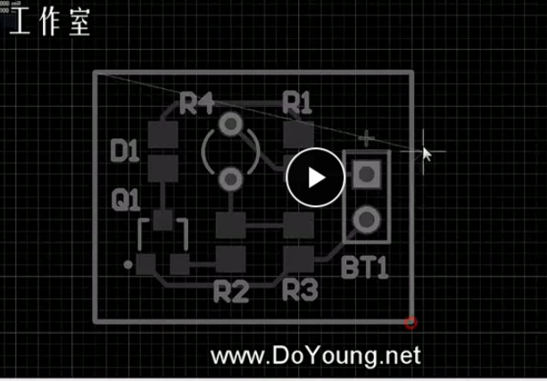
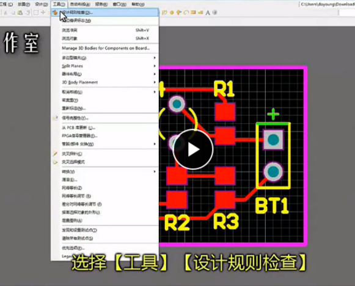
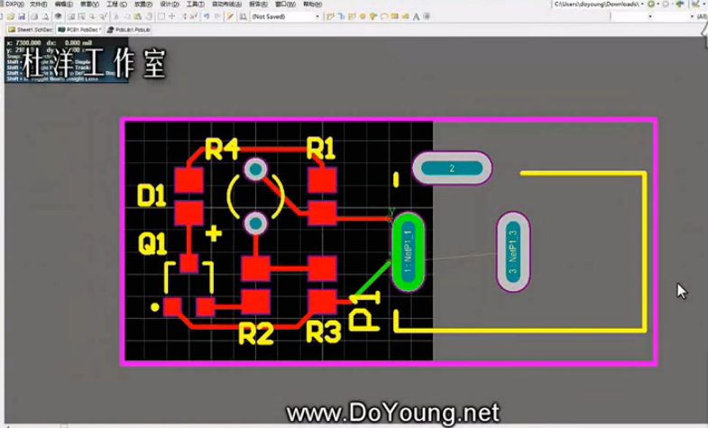

入门PCB设计--学习笔记
====
#新建原理图
原理图的作用就是起到一个电路连接的图形显示，可以直观的看到电路的连接方案，对电路在原理上做一个解释，所以在电路设计之前，都要把电路变成原理图。
- 文件-->新建-->原理图

####调用元件库

- 电机屏幕右侧有“库”可加入元器件,常用的元器件库就前两个

- 带有*标识的那一栏是搜索栏

- 选中元器件后可以点击上方place按键，也可以直接拖动到图纸中
- 可以在英文输入状态键入“pw”进入画线功能，点击鼠标右键课取消画线功能

####如何自己制作元器件的原理图库

当在图库中找不到所需要的元器件，就需要自己制作。元件的管理都在元件库里，就需要新建一个元件库
- 文件-->新建-->库-->原理图库

> - 会打开一个新的窗口，是一个原理图库的文件，文件后缀是.schlab
> - 按住Ctrl 滚滚轮可实现图纸的缩放
> - 切换到原理图的页面，左侧有一个SCH LIBRARY 的窗口，里面会显示自己的元件库，双击可以修改元件库的名字

**在原理图库里新建引脚较多的类似芯片等的元器件**
- 在放置里选择矩形，将鼠标所在的角放置在图纸中央（习惯上），点击一下鼠标，固定第一点，拖动鼠标确定对角点
- 添加引脚，也在**放置**菜单里，可以通过快捷键（PP）
- 鼠标所在的引脚一端必须朝外
- 在未放置引脚前按空格键可90度旋转，点击鼠标左键放置第一个引脚后就会自动弹出第二个
- 在引脚未放置之前电机“Tab”键可进入属性窗口修改引脚标识（引脚号）、显示名称（引脚功能）
> 引脚放置好后点击矩形框可以修改矩形框的大小

- 制作好后，在左侧的SCH Library 窗口中选中库后点击放置就可以放置到原理图当中去了

**在原理图库里新建两个引脚类似LED的元件**
- 在原理图库里点击工具-->新器件，弹出对话框给元器件起名
- 使用放置线来绘制元器件的形状，可以用放置（P）里的多边形来使图形变成实心的

> 使用线使可以点击“Tab"键设置线宽等
> 按字母“g"键可切换栅格对齐精度，在1、5、

#新建工程和原理图

- 新建-->工程-->PCB工程

- 在工程文件上右键-->给工程添加新的-->Schematic

- 在工程上右键-->保存工程

保存好工程后，在右侧的库中选择元器件，放置到图纸中
> 电阻-->res
> 三极管-->q | npn | pnp
> 电池-->battery
> -  在未放置电阻前点击“Tab”修改电阻的标识序号为1，可产生同一元器件的自动序号值
> - 未放置元器件前使用空格键旋转元件
> - 当遇到库中没有的元器件时，可以用类似的元器件代替并标明
> - 双击电阻值可以修改 

- 加载元器件后，先布局，在连线
- 连接完成后在需要检查电路图的正确性，可以将电路图放大查看
- 图纸右下角信息部分需要认真的标注 点击P键-->文本字符串，点击左键放置后双击修改文字信息（也可以在图纸的适当位置加注释信息）

#将原理图导成PCB版图并设置封装
> 集成库：元器件的PCB的封装和原理图绑定

- 检查封装 工具-->封装管理器

> 检查无误后关闭

- 新建PCB文件 在工程上右键-->给工程添加新的-->PCB

> 会产生一个黑色的空白图纸，后缀为.PcbDoc,保存一下

- 再回到原理图，点击设计-->updata pcb1

> - 确定无误后一次点击生效更改、执行更改，可以够选只显示错误，看到没有错误，关闭
> - 然后在PCB图中摆放元件
> - 按住左键可以拖动元件，按空格键可以旋转元件
> - 元器件布局以走线短，元件整齐美观为准

- 重新设定PCB板大小

>通过确定四个点确定矩形

> 点击“g”键设置栅格对齐
> 四个点确定好后点击右键

- 切换到三维显示 查看-->切换到三维显示  （快捷键-->3）

> 点击鼠标右键可以拖动查看
> 按住`shift+右键`可以旋转
> 按住`Ctrl`滚滚轮可以缩放

####改变封装
- 切换到原理图 工具-->封装管理器
- 选中需要修改的元件点击编辑

- 在弹出的`PCB Model`对话框中，将`PCB Library`里的`any`勾选上，然后浏览封装或者直接搜索选择

> 电阻就用0805的贴片封装，0805在这个软件里是2012

- 修改完成后，点击采纳变化，然后依次点击生效更改，执行更改，关闭，在原理图中元件和它的封装就都改了
> 因为软件非正版，所以要在更新之前先关闭下软件，否则可能出现一些小错误

- 在原理图里点击`设计--update PCB`,接着点击生效更改，执行更改，关闭

#PCB排布

- 布线  快捷键 `P`

> 在布好的线上单击可以修改线路

**报告-->测量距离（Ctrl+M）**

- 点击查看-->切换到三维，就可以切换到3D显示
- 点击查看-->适合文件，自动放到合适大小
- 切换到二维，检查电气连接

- 点击运行，生成报告
- 在PCB图页面右侧的`message`栏会显示错误项，双击会将错误项放大
- 在制做过程中随时点击保存
- 在丝印层中加入字体信息，要先选中黄色的丝印层，然后点击 放置-->字符串

#替换电源插针为DC2.1并制作PCB封装

- 先修改原理图，用一个三角的排针替代掉电源

- 保存原理图

- 新建PCB元件库  ： 在工程上点击右键-->给工程添加新的-->PCB Library

> 扩展名为`pcblib`

> - `PL`快捷键画线
> - 点击放置-->焊盘，点击`Tab`键设置参数

切换单位 ： 在对话框左上角点击右键选择第一个

> - 选槽、通孔尺寸0.8mm,长度3.5mm，焊盘的尺寸一般在孔的尺寸是上加上1mm，一般都选择简单
> - 双击`gg`可以自定义栅格宽度
> - 也可以点击`m`键选择`通过XY移动选择`，水平方向为X方向，竖直方向为Y方向

> 双击所画线可以修改线参数
> 复制线： 选中线点击`Ctrl+C`,然后要选一点为参考点

- 封装做好后，保存，可以双击名称修改
- 回到原理图修改元件的封装，点击工具-->封装管理器，选中元件，点击编辑，选`any`，浏览，生效更改，执行更改，关闭，保存原理图
- 关闭PCB文件再更新，设计-->update pcb 生效更改，执行更改，关闭

> 选中线，有个切断轨迹，可以切断直线

- 原来的板子尺寸不够
- 先拉边框

- 再扩大板子 点击  设计-->板子形状-->重定义板子形状

> `pp`连线，`shift+e`切换捕捉
