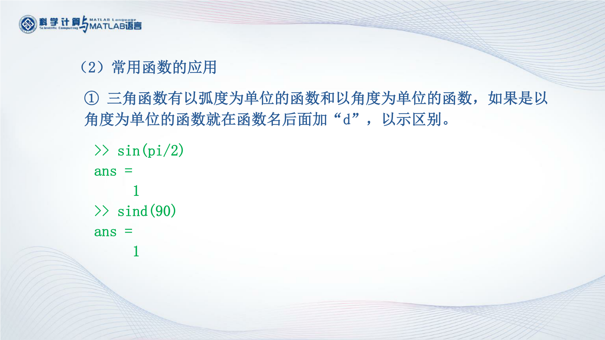
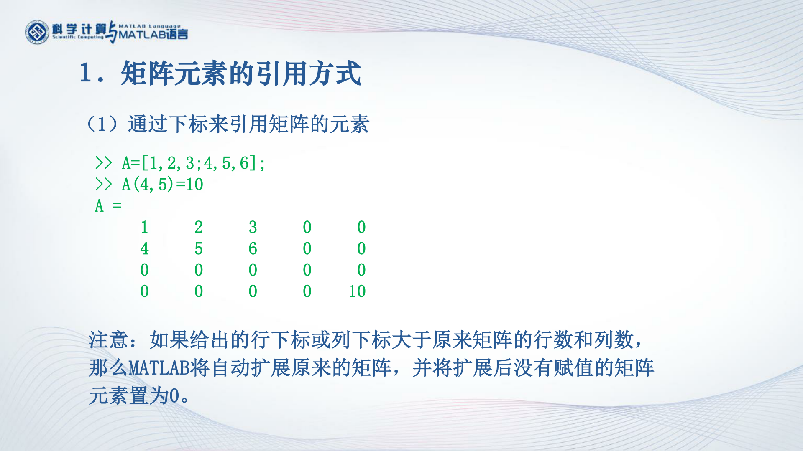
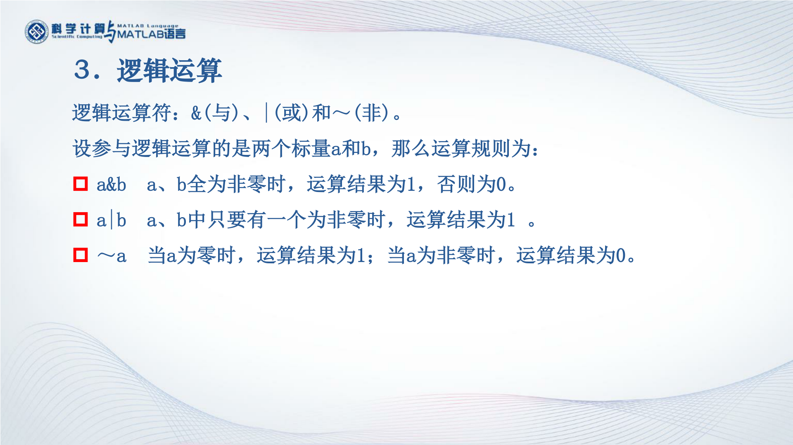
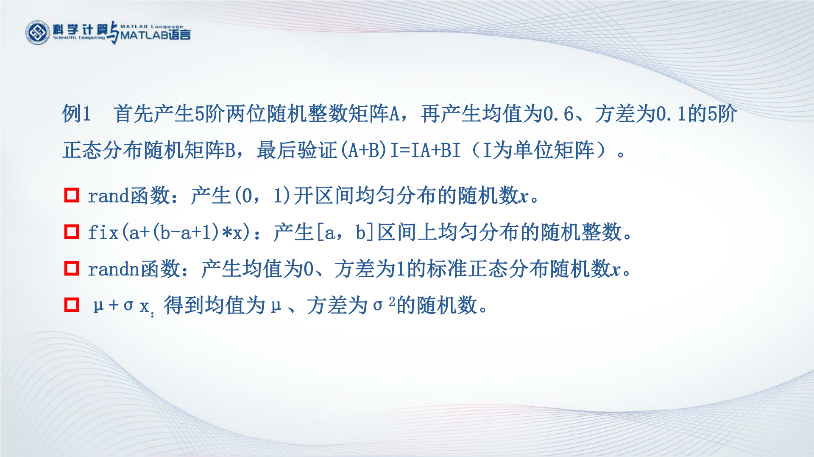

Matlab Learning
===
## 专题一 MATLAB基础知识
### 1.1 MATLAB系统环境
##### MATLAB操作界面的组成


工作区以表格形式显示变量信息

##### MATLAB的搜索路径


在定义变量时一般不要使用matlab内部函数名


###### 设置文件搜索路径


### 1.2 MATLAB数值数据
##### 数值数据类型的分类


带符号8位二进制最左边移位是符号位，0表示正数，1表示负数


> MATLAB提供了数据类型转换函数来实现数据类型的转换，
> 例如，uint8函数将数值数据转换为无符号8位整数
> int8函数将数值数据转换为带符号8位整数


> 浮点系数据分为**单精度**型和**双精度**型，
> 单精度型实数在内存中占用4个字节
> 而双精度型实数在内存中占用8个字节
> 所以双精度型的数据精度更高

在MATLAB中，数值数据默认是双精度型


> 调用`class`函数得到数4的数据类型


##### 数值数据的输出格式


##### 常用的数学函数

> 函数的自变量规定为矩阵变量，当然也可以是标量，标量本身是矩阵的一种特例
> 调用`exp`函数求自然指数





> 调用`rem`函数求余数


> MATLAB提供了一个判断n是否素数的函数`isprime(n)`
> 当n是素数时返回1
> 否则返回0


###### 源代码
```
例1  分别求一个三位正整数的个位数字、十位数字和百位数字。
m=345;
m1=rem(m,10)
m2=rem(fix(m/10),10)
m3=fix(m/100)

例2  求[1，100]区间的所有素数。
x=1:100;
k=isprime(x);
k1=find(k);
p=x(k1)

```
### 1.3 变量及其操作
##### 变量与赋值语句
> 变量本质上讲是内存单元的一个抽象
> 变量一般都有一个名字，通过变量名就可以访问内存单元


> 如果再赋值语句后加`；`,matlab只执行赋值，不会再显示运算后变量的结果


##### 预定义变量


> 在绘图的时候，如果想裁掉其中一部分，那么，只要把要裁掉部分的坐标数据设为NaN就可以了
> 预定义变量有各自特定的含义，在使用时要尽量避免对他们重新赋值

##### 变量的管理


> 右击某个变量在菜单中选择相应操作就可以了


> 这两个命令用于显示在MATLAB工作空间中已经驻留的变量名清单


MAT文件的生成

> 把已存在的变量a,x 存在 mydata mat 文件中

### 1.4 MATLAB矩阵的表示

##### 矩阵的建立


##### 冒号表达式
> 用冒号表达式产生行向量


> 用`linspace`函数产生行向量


##### 结构矩阵和单元矩阵


### 1.5 矩阵元素的引用
##### 矩阵元素的引用方式



##### 利用冒号表达式获得子矩阵


##### 利用空矩阵删除矩阵的元素


##### 改变矩阵的形状


### 1.6 MATLAB基本运算
MATLAB的运算都是针对矩阵而言的
##### 算数运算


> 对于矩阵来说，右除和左除表示两种不同的除数矩阵和被除数矩阵关系


> 对于含有标量的运算，两种除法的结果相同


> 点运算是MATLAB很有特色的一个运算符，在实际应用中起着很重要的作用，也是许多初学者容易弄混的一个问题


##### 关系运算


> `rem`函数是求余运算 

##### 逻辑运算



> 在算数运算、关系运算和逻辑运算中
> 算数运算的优先级最高
> 逻辑运算的优先级最低
> 但逻辑非运算是单目运算，它的优先级比双目运算要高


> 因为m是向量，所以m1,m2,m3都是和m同长度的向量
> 调用`find`函数，在向量m中找到水仙花数的序号赋给变量k
> k也是一个向量

###### 源代码
```
例1  当x=0.1、0.4、0.7、1时，分别求y=sin x cos x的值。
x=0.1:0.3:1;
y=sin(x).*cos(x)

例2  建立3阶方阵A，判断A的元素是否为偶数。
A =[24,35,13;22,63,23;39,47,80]
P=rem(A,2)==0

例3  水仙花数是指各位数字的立方之和等于该数本身的三位正整数。求全部水仙花数。
m=100:999;
m1=rem(m,10);
m2=rem(fix(m/10),10);
m3=fix(m/100);
k=find(m==m1.*m1.*m1+m2.*m2.*m2+m3.*m3.*m3)
s=m(k)
```

### 1.7 字符串处理

##### 字符串的表示

> 一个字符串相当于一个行向量


> `ch(end:-1:1)`初始项为最后一个字符，末项为第一个字符，步长为-1
> 第三个：首先找到字符串中有小写字母的位置，用`find`函数
> 第四个：就是统计向量k的个数，因为k是找到的小写字母的位置
> 利用`length`函数统计个数

##### 字符串的操作


###### 源代码
```
例1  建立一个字符串向量，然后对该向量做如下处理：
① 取第1～5个字符组成的子字符串。
② 将字符串倒过来重新排列。
③ 将字符串中的小写字母变成相应的大写字母，其余字符不变。
④ 统计字符串中小写字母的个数。
ch='ABc123d4e56Fg9';
subch=ch(1:5)   
revch=ch(end:-1:1)  
k=find(ch>='a'&ch<='z') 
ch(k)=ch(k)-('a'-'A')        
length(k)
```

## 专题二 MATLAB矩阵处理
### 2.1 特殊矩阵
##### 通用性的特殊矩阵





##### 用于专门学科的特殊矩阵


> 设置输出格式有理数输出


> `inv`函数求矩阵的逆

### 2.2 矩阵变换

### 2.3 矩阵求值

### 2.4 矩阵的特征值与特征向量

### 2.5稀疏矩阵

## 专题三 MATLAB程序流程控制
### 3.1 顺序结构程序

### 3.2 用if语句实现选择结构

### 3.3 用switch语句实现选择结构

### 3.4 用for语句实现循环结构

### 3.5 用while语句实现循环结构

### 3.6 函数文件的定义与调用

### 3.7 函数的递归调用

### 3.8 函数参数与变量的作用域

## 专题四 MATLAB绘图
### 4.1 二维曲线

### 4.2 绘制图形的辅助操作

### 4.3 其他形式的二维曲线

### 4.4 三维曲线

### 4.5 三维曲面

### 4.6 图形修饰处理

### 4.7 交互式绘图工具


## 专题五 数据分析与多项式计算
### 5.1 数据统计分析

### 5.2 多项式的计算

### 5.3 数据插值

### 5.4 数据插值应用举例

### 5.5 曲线拟合

### 5.6 曲线拟合应用举例
## 专题六 数值微积分与方程求解
### 6.1 数值微分与数值积分

### 6.2 线性方程组求解

### 6.3 线性方程组应用举例

### 6.4 非线性方程求解与函数极值计算

### 6.5 常微分方程数值求解

### 6.6 常微分方程应用举例
## 专题七 MATLAB符号计算
### 7.1 符号对象

### 7.2 符号微积分

### 7.3 级数

### 7.4 符号方程求解

## 专题八 MATLAB图形用户界面设计

## 专题九 Simulink 系统仿真

## 专题十 外部程序接口