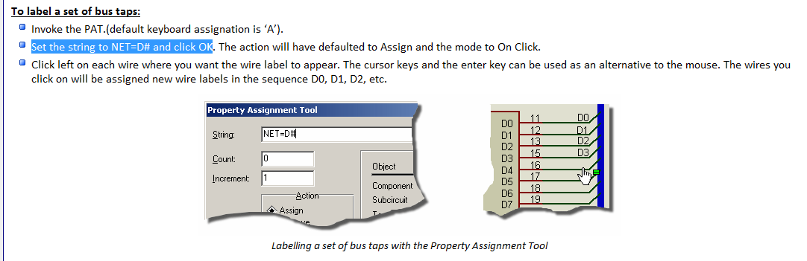

proteus learning
===
- 电源POWER、地GROUND在`terminals model`终端模式里
- 双击电源会弹出编辑框，可以输入标志信息
- 旋转元器件
>  1 默认快捷键为`- +`
>  2 修改快捷键的方法为：`system-->Set Keyboard Mapping-->Object Context Commands`
>  3 可以改为空格键

- 移动显示区域
> 1 点击鼠标中键
> 2 按`F5`，窗口会移动到以鼠标为中心显示

- 缩放

> 按住`sheft`,用鼠标框选想要放大的区域即可
> 滚动滚轮

- 删除

> 双击右键

- 当连接好一根线后，如果其他的线和这根线一样的连法，只要在其余的连接点上双击左键即可自动连接完其余的线

- 将某一部分保存为块文件

> 先框选中需要保存的部分
> `File-->Export Section`
> 文件后缀名为`.sec`

- 然后在其他文件中就可以将这一部分导入，节省时间

> `File-->Import Section`

- 新建第二页

> `Design-->New Sheet`

- 复制粘贴

> 右键`Copy To Clipboard`,
> 右键`Paste From Clipboard`
> 这个方法可以将整个原理图进行操作

- 给文档命名

> `Design-->Edit Sheet Properties` 编辑文档属性，在文档标题中`sheet title`输入名称

- 切换是否让元件序号自动加

> `Tools-->Real Time Annotation`工具-->实时标注

- 全局标注

> `Global Annotator`

- 对于一个电源，在没有进行标注的情况下默认为（VCC/VDD）5V，可以在`Design-->Configure Power Rails`里看到，所以需要多大电压是一定要标注清楚。任何一个电源端子想要输出电压就必须具有电源属性，就是说它要连接到电源网络上去,r被列在Power Supply 里面。和电源引脚连接在一起的网络称为电源网络，想要进行仿真的话，电源网络必须要具有电压属性。可以自己根据需要新建Power Supply.但是在命名电源是如果带上正负号，就直接使电源端子具有了电压属性。

- PAT属性分配工具
  - `tools-->Property Assignment Tool`
  - 快捷键`A`
  - `Set the string to NET=D# and click OK` 可以方便的给一组线命名

- Search and Tag (查找并选定)
  - `Tools-->Search and Tag`

